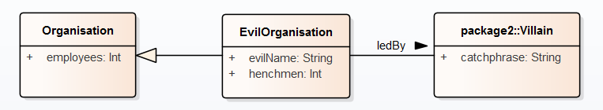

# Example

This page describes a fictitious model to illustrate the conversion of the tool.
The model is available as an [Enterprise Architect project](./examples/example.eap)
or as [XMI](./examples/example.xml) (can be used to visualise the model, not for conversion).

This model contains 3 classes spread over 2 packages.

All elements are tagged as described on project description.
For ease of reading, all tags are listed below.

## Tags

### Package 1

- baseURI: `http://example.com/ns1#`
- baseURIabbrev: `ex1`

### Package 2

- baseURI: `http://example.com/ns2#`
- baseURIabbrev: `ex2`

### Class Organisation

- label-nl: `organisatie`
- uri: `https://www.w3.org/ns/org#Organization`

### Class EvilOrganisation

- definition-en: `An organisation whose aim is to conquer the world.`
- definition-nl: `Een organisatie gericht op het veroveren van de wereld.`
- label-en: `Evil organisation`
- label-nl: `Criminele organisatie`

### Class Villain

- definition-en: `An enemy of the world.`
- definition-nl: `Een vijand van de wereld.`
- label-en: `Villain`
- label-nl: `Slechterik`

### Attribute employees

- definition-en: `The number of employees.`
- definition-nl: `Het aantal medewerkers.`
- label-en: `employees`
- label-nl: `medewerkers`

### Attribute evilName

- definition-en: `The name of the organisation that causes fear in citizens.`
- definition-nl: `De naam waarmee de organisatie angst inboezemt.`
- label-en: `evil name`
- label-nl: `slechte naam`
- parentURI: `http://www.w3.org/2000/01/rdf-schema#label`

### Attribute henchmen

- definition-en: `The number of henchmen.`
- definition-nl: `Het aantal handlangers.`
- label-en: `henchmen`
- label-nl: `handlangers`
- parentURI: `http://example.com/ns1#employees`

### Attribute catchphrase

- definition-en: `The preferred catchprase.`
- definition-nl: `De geprefereerde slogan.`
- label-en: `catchphrase`
- label-nl: `slogan`

### Connector ledBy

- definition-en: `The mastermind of the organisation.`
- label-en: `led by`
- label-nl: `geleid door`
- package: `package1`

Note the missing `definition-nl`!

## Configuration

The configuration specifies RDF prefixes that can be used
and how tags are used in the transformation. In this typical case,
they are used simply to add information to each RDF term.

    {
      prefixes: {
        rdf: "http://www.w3.org/1999/02/22-rdf-syntax-ns#",
        rdfs: "http://www.w3.org/2000/01/rdf-schema#",
        org: "https://www.w3.org/ns/org#",
        owl: "http://www.w3.org/2002/07/owl#",
        xsd: "http://www.w3.org/2001/XMLSchema#"
      },
      internalMappings: [
        {
          tag: "label-nl",
          property: "http://www.w3.org/2000/01/rdf-schema#label",
          mandatory: true,
          lang: "nl"
        },
        {
          tag: "definition-nl",
          property: "http://www.w3.org/2000/01/rdf-schema#comment",
          mandatory: true,
          lang: "nl"
        },
        {
          tag: "label-en",
          property: "http://www.w3.org/2000/01/rdf-schema#label",
          mandatory: true,
          lang: "en"
        },
        {
          tag: "definition-en",
          property: "http://www.w3.org/2000/01/rdf-schema#comment",
          mandatory: true,
          lang: "en"
        }
      ],
      externalMappings: [
        {
          tag: "label-nl",
          property: "http://www.w3.org/2000/01/rdf-schema#label",
          mandatory: false,
          lang: "nl"
        },
        {
          tag: "definition-nl",
          property: "http://www.w3.org/2000/01/rdf-schema#comment",
          mandatory: false,
          lang: "nl"
        }
      ]
    }

## Output

Below is the RDF output of the tool. Note that there was a single mandatory tag missing in the UML model. This is reflected as a `TODO` in the generated RDF, additionally, a warning is logged by the tool.

Note the difference in output for the external terms (such as `Organisation`), in-scope terms (newly defined terms in the package being transformed, such as `EvilOrganisation`) and out-of-scope terms (newly defined terms in other packages, such as `Villain`).

    @prefix rdf: <http://www.w3.org/1999/02/22-rdf-syntax-ns#> .
    @prefix org: <https://www.w3.org/ns/org#> .
    @prefix owl: <http://www.w3.org/2002/07/owl#> .
    @prefix xsd: <http://www.w3.org/2001/XMLSchema#> .
    @prefix rdfs:<http://www.w3.org/2000/01/rdf-schema#> .
    @prefix ex1: <http://example.com/ns1#> .
    
    <http://example.com/ns1>
      a   owl:Ontology ;
      <http://purl.org/vocab/vann/preferredNamespacePrefix>
      "ex1" ;
      <http://purl.org/vocab/vann/preferredNamespaceUri>
      "http://example.com/ns1" .
    
    ex1:EvilOrganisation
      a   owl:Class ;
      rdfs:comment "Een organisatie gericht op het veroveren van de wereld."@nl , "An organisation whose aim is to conquer the world."@en ;
      rdfs:isDefinedBy <http://example.com/ns1> ;
      rdfs:label "Evil organisation"@en , "Criminele organisatie"@nl ;
      rdfs:subClassOf org:Organization .
    
    ex1:employees
      a   owl:DatatypeProperty ;
      rdfs:comment "The number of employees."@en , "Het aantal medewerkers."@nl ;
      rdfs:domain org:Organization ;
      rdfs:isDefinedBy <http://example.com/ns1> ;
      rdfs:label "medewerkers"@nl , "employees"@en ;
      rdfs:range xsd:int .
    
    ex1:evilName
      a   owl:DatatypeProperty ;
      rdfs:comment "The name of the organisation that causes fear in citizens."@en , "De naam waarmee de organisatie angst inboezemt."@nl ;
      rdfs:domain ex1:EvilOrganisation ;
      rdfs:isDefinedBy <http://example.com/ns1> ;
      rdfs:label "evil name"@en , "slechte naam"@nl ;
      rdfs:range xsd:string ;
      rdfs:subPropertyOf rdfs:label .
    
    ex1:henchmen
      a   owl:DatatypeProperty ;
      rdfs:comment "Het aantal handlangers."@nl , "The number of henchmen."@en ;
      rdfs:domain ex1:EvilOrganisation ;
      rdfs:isDefinedBy <http://example.com/ns1> ;
      rdfs:label "henchmen"@en , "handlangers"@nl ;
      rdfs:range xsd:int ;
      rdfs:subPropertyOf ex1:employees .
    
    ex1:ledBy
      a   owl:ObjectProperty ;
      rdfs:comment "The mastermind of the organisation."@en , "TODO"@nl ;
      rdfs:domain ex1:EvilOrganisation ;
      rdfs:isDefinedBy <http://example.com/ns1> ;
      rdfs:label "geleid door"@nl , "led by"@en ;
      rdfs:range <http://example.com/ns2#Villain> .
    
    org:Organization
      rdfs:label "organisatie"@nl .
