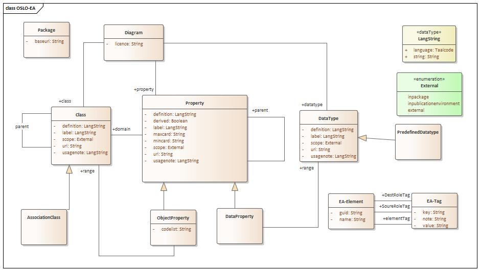

# Enterprise Architect Conversion Tool

This project was created as part of the OSLO² ([Github](http://informatievlaanderen.github.io/OSLO/),
 [Vlaanderen.be](https://overheid.vlaanderen.be/producten-diensten/OSLO2)) initiative by the Flemish Government.
 The OSLO² project aims to achieve a solid standard for data exchange between (local) governments.
 These data exchange formats are created as RDF vocabularies (or ontologies), following the principles of the Linked
 Data movement.

This tool provides an automatic way to create ontologies from an Enterprise Architect (a commonly 
used UML modelling tool) project that has the proper format.

An example is available [here](./Example.md).

## Building & Running

Building requires Maven and Java (JDK) to be installed.

    mvn clean package
    cd target
    java -jar <jarfile> --help

The build process is dockerized in two stages, to enable offline builds. In the makefile the target build will create a first base image.
This will download all dependencies. From that moment on, the target exec can be used to create offline builds. In this way the development
process can be speeded up. The target format enables the formatting of the source code. 

Typical usage (for more options/commands, use `--help`):

    # Converts a diagram in an EA project to a RDF ontology (in the Turtle format).
    # Any ERROR or WARNING log statements should be adressed before using the generated ontology.
    java -jar <jarfile> convert --diagram <diagramName> --config <configFile> --input <EA project file> --output <turtle output file>
    
    # Converts a diagram in a tab separated value file listing the hierarchy, datatypes and more.
    java -jar <jarfile> tsv --diagram <diagramName> --config <configFile> --input <EA project file> --output <turtle output file>


### Source code formatting

The source code is formatted using [google java format](https://github.com/google/google-java-format).

## Conversion Conventions

Due to the mismatch between UML and RDF, there are some constraints that must be followed
and some metadata that should be specified. This metadata is presented in the form of tags
assigned to the elements in the EA project. The configuration specified when running the tool
determines how these tags are converted into RDF.

**Tag values are limited to 256 characters**, to get around this limitation, you can use the
value `NOTE` to indicate tag note should be used as a value.

The specific tags used for the OSLO² project are listed [here](OSLO-configuration.md).


## Annotation of the UML model 

The Enterprise Architect Conversion Tool is a tool supporting the key idea to model a semantic model in UML. 
In OSLO the normative document is not the UML diagram but the semantic model that it is representing.
Instead of reinventing a new graphical language, OSLO decided to (re)use UML as graphical modelling language.
For coherency reasons accross all specifications it is easier to transform a UML diagram to a semantic representation, than transforming an semantic representation in a UML notation.

To create the semantic models the UML diagrams have to be converted into a representation that is indepedent from the editorial environment.
In case of OSLO the editorial environment is Enterprise Architect.
To ease future processing a json(-ld) representation has been chosen as target.

The connection between the UML graphical language and semantic world is based on interpreting the UML language but also on the additional annotations provided by the editors.
These annotations are key because they control 
  - the URI assignment
  - the human readible semantics

In addition some annotations are added to facilitate the control of the scope of the content of the semantic model.

An graphical overview of the information is shown below.



Each attribute/property corresponds with an annotation.
In EA these annotations are expressed as tags.
The tags have the following representation

```
   {documenttype}-{annotation}-{language}
```

The {documenttype} can be 
   - **empty**:  corresponds with the vocabulary interpretation. The base information about the term.
   - **ap**: application profile (ap) 

The {language} corresponds to the 2-letter code for a language in which the content of the annotation is expressed.

Examples:
  - `label-nl`: the tag expresses the label of the term in Dutch at the level of a vocabulary. 
  - `ap-usageNote-en`: the tag expresses the usage note in English for the application profile

The pattern is very useful as it allows to have two perspectives on the same term in the UML file.
One perspective is the base reference: the vocabulary, and the other perspective is the application usage context.
Having the ability to have them side by side make it is much easier for editors to ensure the reuse of a term is done properly.


Not all annotations support a prefix {documenttype} or suffix {language}. 
For instance: `uri` has no prefix or suffix as a term should have only one globally unique persistent identifier. 


## Annotation of the UML model - older documentation


All tags listed below can be customised through the configuration, [see below](#builtin-tags).

### Package

A package is mapped to an `owl:Ontology`, each element specified in the ontology is assumed to be specified in the ontology.

Tags:

- `baseURI`: The base URI for each element defined in this package (eg: `http://example.org/ns#`).
- (optional) `baseURIabbrev`: The preferred abbreviated form of the `baseURI`,
 used to generate the [preferred namespace prefix](http://vocab.org/vann/#preferredNamespacePrefix)
 as well as turtle prefixes. (Eg: `ex`)
- (optional) `ignore`: A boolean flag that will make the tool ignore this package and anything defined inside it. (Eg: `true`)
- (optional) `ontologyURI`: The URI of the corresponding `owl:Ontology`. Defaults to `baseURI` minus the last character
 (eg: `http://example.org/ns`).

### Class, DataType & Enumeration

A class, datatype or enumeration is mapped to an `owl:Class`.

Enumerations are restricted to one of the specified values using `owl:oneOf`.

Tags:

- (optional) `ignore`: A boolean flag that will make the tool ignore this element, its attributes and
connectors (eg: `true`).
- (optional) `literal`: A boolean flag to indicate whether this element represents a literal type.
Reflected in the type of the properties referring to this element. (Defaults to `false`.) 
- (optional) `name`: The string used to complete the URI for this element.
 If not specified, the name of the class/datatype will be used.
 (Eg: specifying `Canine` as `name` on a class called `Dog` will result in the URI `http://example.org/ns#Canine`.)
- (optional) `package`: The name of the package (representing an ontology) that should define the translations
 for the externally defined class. Defaults to the
 name of the package in which this element is defined. [More details below.](#specifying-packages)
- (optional) `uri`: The URI of the externally defined class, this will take preference over the `baseURI`/`name` combo.
 Eg: `http://example.org/ns/special#Canine`.

### Attribute

Attributes are mapped to `rdf:Property`, `owl:DatatypeProperty` or `owl:ObjectProperty`.

Tags:

- (optional) `domain`: The URI of the domain for this property (overriding the automatically derived one).
- (optional) `ignore`: A boolean flag that will make the tool ignore this property (eg: `true`).
- (optional) `literal`: Only useful combined when with the `range` tag, indicates whether the
range is a literal (defaults to `false`)
- (optional) `name`: The string used to complete the URI for this element.
If not specified, the name of the attribute will be used. (Eg: `canine-name`.)
- (optional) `package`: The name of the package (representing an ontology) that should define this
property. Defaults to the package of the class/datatype/enumeration in which this attribute is
specified. [More details below.](#specifying-packages)
- (optional) `parentURI`: the full URI of any property this property should be a subProperty of.
(Eg: `https://www.w3.org/2000/01/rdf-schema#label`)
- (optional) `range`: The URI of the range for this property (overriding the automatically derived one).
Use of this tag will result in a `owl:ObjectProperty` being generated.
- (optional) `uri`: The complete URI to use, this will take preference over the `baseURI`/`name` combo.
Eg: `http://example.org/ns/special#canine-name`.

The datatype of the attribute will be mapped to (first match wins):
 
 - One of the supported primitive XSD/RDF/RDFS types if the datatype is `Boolean`, `Date`, `DateTime`, `Double`,
  `Duration`,`HTML`, `Int`, `Integer`, `LangString`, `Literal`, `Month`, `MonthDay`, `String`, `Time`, `URI`, 
  `Year` or `YearMonth`
 - The class (or datatype) whose name matches the datatype

### Connector

A generalization connector will be converted into a `rdfs:subClassOf` triple.
An association or aggregation connector will be converted into a `owl:ObjectProperty`.
Properties follow the direction of the label associated with the connector, or if these are not present,
the direction of the connector.

Connectors can be defined between elements from different packages, so it is not always clear to
which package (= ontology) they belong.

Tags:

- `package`: the name of the package (representing an ontology) that should define this
property. Not required if `uri` is specified. Defaults to guessing this based on the connected elements.
[More details below.](#specifying-packages)
- (optional) `domain`: The URI of the domain for this property (overriding the automatically derived one).
- (optional) `ignore`: A boolean flag that will make the tool ignore this property (eg: `true`).
- (optional) `name`: The string used to complete the URI for this element.
If not specified, the name of the attribute will be used. (Eg: `petPicture`.)
- (optional) `parentURI`: the full URI of any property this property should be a subProperty of.
(Eg: `http://xmlns.com/foaf/spec/#term_depiction`)
- (optional) `range`: The URI of the range for this property (overriding the automatically derived one).
- (optional) `uri`: The complete URI to use, this will take preference over the `baseURI`/`name` combo.
Eg: `http://example.org/ns/special#petPicture`.


## Specifying Packages

Transforming simple models to RDF is straightforward. This becomes more complicated once
multiple vocabularies interact. For example, we could define a new attribute on an externally
defined class. In this case we do not want to include the definition of the class itself in our
ontology. On the other hand, we could want to include additional translations of that class.

Each section below describes what gets exported to the RDF file
when running this tool. There are 3 options:
- An internal, active term: the term is defined by us, in the diagram being exported.
 This means all information should be outputted. This uses the `internalMapping` from the configuration.
- An external term: the term is externally defined and reused by us, we may want to add some
additional information to it, such as a translation.
 This uses the `externalMapping` from the configuration.
- An nonactive term: the term is defined in a different diagram.
 In this case nothing will be outputted.

### Class, Datatype & Enumeration

The term is seen as an internal, active term when:
- there is no `uri` tag present
- the element is defined in, or has its `package` tag set to the package being exported

It is considered an external term when:
- there is a `uri` tag present
- the element is defined in, or has its `package` tag set to the package being exported

The term is seen as an nonactive term when:
- the element is not defined in the package being exported

### Attributes & Connectors

The term is seen as an internal, active term when:
- there is no `uri` tag present
- the `package` tag (or its default value) refers to the package being exported

It is considered an external term when:
- there is a `uri` tag present
- the `package` tag (or its default value) refers to the package being exported

## Association Classes

**Note**: because association classes exists in UML only and poorly
reflect the resulting RDF, it is discouraged to use them.

In UML, connectors can have a association class to identify information being tracked on the association between
2 classes. In RDF this is represented by simply having the association class being put in the middle of the
connecting property.
Taking the reverse properties into account, this effectively forms 4 separate properties instead of one.

Any connector that has an association class should prefix all tags with `source-`,
`source-rev-`, `target-` and `target-rev-`.
Tags of the first form (eg: `source-label-en`) will relate to the property connecting the starting element
with the association class. Likewise, the second form will relate to the property connecting the association class
with the the source element. Starting and ending elements are defined by the direction of the label of the connector.

As an example, the following diagram:


would be converted as follows:


If not all properties are desired in the conversion, they should be marked using the ignore tag
(eg: `source-rev-ignore` should be set to `true`).

## Configuration

The configuration file is a JSON file that affects how the UML diagram is converted.
Broadly, it specifies the following aspects:
- the prefixes used in a converted diagram
- the mappings of class/attribute/connector/... tags to properties
  - on the level of the ontology (= a diagram)
  - for the terms present in and defined in the package of the diagram being converted
  - for the terms present in but not defined in the package of the diagram being converted
- overrides for the builtin tags (documented below)

A typical configuration is listed at the end of this section.

### Prefixes

Prefixes are straightforward:

    {
      prefixes: {
        rdf: "http://www.w3.org/1999/02/22-rdf-syntax-ns#",
        rdfs: "http://www.w3.org/2000/01/rdf-schema#",
        owl: "http://www.w3.org/2002/07/owl#"
      }
      ...
    }

### Mappings

The mappings are specified in 3 blocks, each affecting a different part of the conversion:
- `ontologyMappings` specify which tags to process on the level of each package, these
tags will end up as properties on the `owl:Ontology` instance.
- `internalMappings` affect the classes, attributes... that are defined in the package of
the diagram being converted and are shown on the diagram.
- `externalMappings` affect the classes that are not defined in the package of the diagram
being converted, but are shown on the diagram.

Each block consists of a list of mappings. Each mapping is specified as follows:
- `tag`: the name of the tag as used in EA that contains the value to be mapped.
- `property`: the RDF property (URI) to which the value will be mapped.
- `mandatory`: a boolean determining whether the tool should provide a warning if no value is specfied.
- `type`: the URI of the datatype to be used in the RDF for the mapped value. Defaults to
`http://www.w3.org/1999/02/22-rdf-syntax-ns#langString`. You can use `http://www.w3.org/2000/01/rdf-schema#Resource`
 to convert the values to links instead of literals.
- `lang`: the language of `rdf:langString` value.
- `fallbackTags`: in case no entry was found for the `tag` of this mapping, the tool
will try again with each of the tags specified in this list (in order), until a value is found.


    {
      ontologyMappings: [
        {
          tag: "issued",
          property: "http://purl.org/dc/terms/issued",
          mandatory: true,
          type: "http://www.w3.org/2001/XMLSchema#date"
        }
      ],
      internalMappings: [
        {
          tag: "label-nl",
          property: "http://www.w3.org/2000/01/rdf-schema#label",
          mandatory: true,
          lang: "nl"
        },
        {
          tag: "pref-label-nl",
          property: "http://www.w3.org/2004/02/skos/core#prefLabel",
          fallbackTags: ["label-nl"]
          mandatory: true,
          lang: "nl"
        }
      ],
      externalMappings: [
      ],
      ...
    }

### Builtin Tags

All tags defined above can in fact be customised through the configuration.
The snippet belows shows the format to use in the configuration and each default value.

```
{
  prefixes: {
    ...
  },
  builtinTags: {
    LOCALNAME: "name",
    EXTERNAL_URI: "uri",
    IGNORE: "ignore",
    DEFINING_PACKAGE: "package",
    SUBPROPERTY_OF: "parentURI",
    DOMAIN: "domain",
    RANGE: "range",
    IS_LITERAL: "literal",
    PACKAGE_BASE_URI: "baseURI",
    PACKAGE_BASE_URI_ABBREVIATION: "baseURIabbrev",
    PACKAGE_ONTOLOGY_URI: "ontologyURI"
  },
  internalMappings: [
    ...
  ]
}
```

### Example configuration


    # The ontology will have a title and (xsd:date) date attribute.
    # Newly defined terms will have a "nl"-typed label, pref-label and comment.
    # In case no "pref-label-nl" tag exists, the value from "label-nl" will be used.
    # Existing terms will only get a "nl" translations.
    # The "mandatory" key determines whether the tool warns for missing values.
    {
      prefixes: {
        rdf: "http://www.w3.org/1999/02/22-rdf-syntax-ns#",
        rdfs: "http://www.w3.org/2000/01/rdf-schema#",
        owl: "http://www.w3.org/2002/07/owl#"
      },
      ontologyMappings: [
        {
          tag: "title-nl",
          property: "http://purl.org/dc/terms/title",
          mandatory: true,
          lang: "nl"
        },
        {
          tag: "issued",
          property: "http://purl.org/dc/terms/issued",
          mandatory: true,
          type: "http://www.w3.org/2001/XMLSchema#date"
        }
      ],
      internalMappings: [
        {
          tag: "label-nl",
          property: "http://www.w3.org/2000/01/rdf-schema#label",
          mandatory: true,
          lang: "nl"
        },
        {
          tag: "pref-label-nl",
          property: "http://www.w3.org/2004/02/skos/core#prefLabel",
          fallbackTags: ["label-nl"]
          mandatory: true,
          lang: "nl"
        },
        {
          tag: "definition-nl",
          property: "http://www.w3.org/2000/01/rdf-schema#comment",
          mandatory: true,
          lang: "nl"
        }
      ],
      externalMappings: [
        {
          tag: "label-nl",
          property: "http://www.w3.org/2000/01/rdf-schema#label",
          lang: "nl"
        }
      ]
    }
